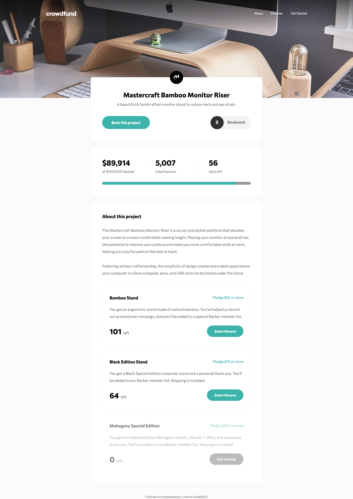

# Frontend Mentor - Interactive card details form solution

This is a solution to the [Crowdfunding product page challenge on Frontend Mentor](https://www.frontendmentor.io/challenges/crowdfunding-product-page-7uvcZe7ZR). Frontend Mentor challenges help you improve your coding skills by building realistic projects. 

## Table of contents

- [Overview](#overview)
  - [The challenge](#the-challenge)
  - [Screenshot](#screenshot)
  - [Links](#links)

  - [Built with](#built-with)

- [Author](#author)

## Overview

### The challenge

Users should be able to:

- Fill in the form and see the card details update in real-time
- Receive error messages when the form is submitted if:
  - Any input field is empty
  - The card number, expiry date, or CVC fields are in the wrong format
- View the optimal layout depending on their device's screen size
- See hover, active, and focus states for interactive elements on the page

### Screenshot

### Links

- Solution URL: https://github.com/ortalyarts/frontendmentor-interactive-card-details-form
- Live Site URL: https://frontendmentor-interactive-card-details-form.vercel.app/

## My process

### Built with

- Semantic HTML5 markup
- CSS custom properties
- Flexbox, CSS Grid
- Mobile-first workflow
- Vanilla JS
- Dialog
- Web Animations API for animating the Status Bar
- Fully accessible: top menu (inc. hamburger menu), Dialog, Accordion
- JSON to populate the product's list

## Author

- OrtalyARTS Portfolio Website - [@ortalyARTS.com](https://ortaly.com/)
- Frontend Mentor - [@ortalyARTS](https://www.frontendmentor.io/profile/ortalyARTS)
- Linkedin - [@ortalyARTS](www.linkedin.com/in/ortalyarts) 

